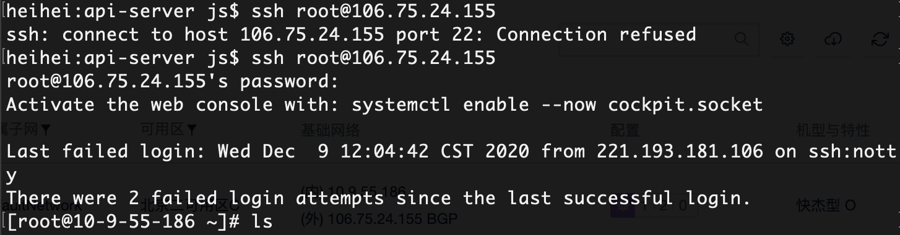
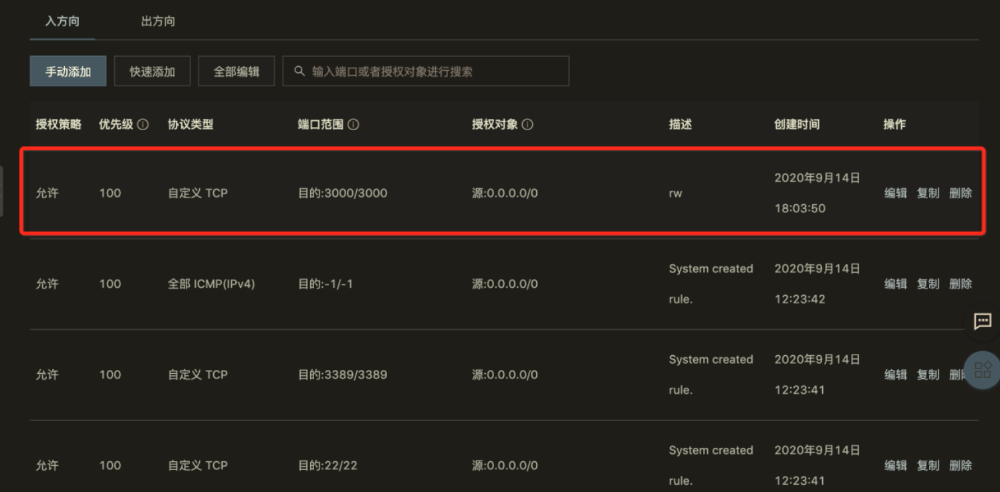
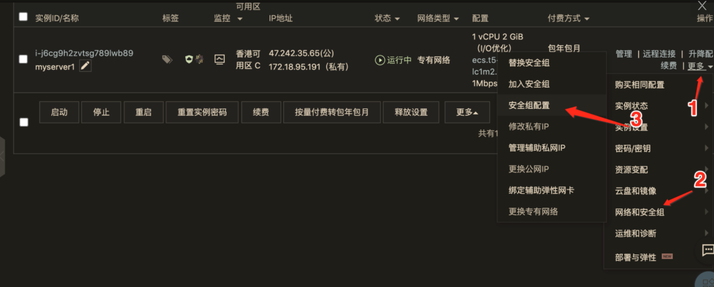

# 购买服务器/部署应用

- nllcoder.com
- 8.210.44.202
- 1234@abc



## 阿里云服务器 - CentOS 8
### 购买服务器

- [https://www.aliyun.com/product/ecs?spm=5176.6660585.h2v3icoap.14.496e6bf8b6KqcF](https://www.aliyun.com/product/ecs?spm=5176.6660585.h2v3icoap.14.496e6bf8b6KqcF)
- 购买香港节点（域名不需要备案）
- 系统选择的是 CentOS 8，或者其它系统

### 远程登录服务器
```bash
ssh root@47.242.229.124

curl https://www.youtube.com
```
### SSH 免密登陆

- http://www.ruanyifeng.com/blog/2011/12/ssh_remote_login.html
- 客户端操作
  - **使用 scp 的时候路径中不能有中文 ！**

```bash
# 生成密钥对
cd C:\Users\Administrator\.ssh
# 客户端生成公钥和私钥的命令
ssh-keygen

# 把公钥拷贝到服务器
scp nllcoder_com_rsa.pub root@nllcoder.com:/root/.ssh

# winscp
```

- 客户端操作---修改本机的 .ssh/config 文件
  - C:\Users\Administrator\\.ssh

```
Host nllcoder.com
HostName nllcoder.com
User root
PreferredAuthentications publickey
IdentityFile C:\Users\Administrator\.ssh\nllcoder_com_rsa
```

- 服务器

```bash
cd ~/.ssh
# 找到 authorized_keys 文件
# 把 nllcoder_com_rsa.pub 文件内容追加到 authorized_keys 文件末尾
cat >> authorized_keys < nllcoder_com_rsa.pub
```


### 安装  Node.js

- 使用 nvm 安装 Node.js
- [https://github.com/nvm-sh/nvm](https://github.com/nvm-sh/nvm)
```bash
# 查看环境变量
echo $PATH

wget -qO- https://raw.githubusercontent.com/nvm-sh/nvm/v0.35.3/install.sh | bash

# 重新连接 ssh
nvm --version

# 安装 Node.js lts
nvm install --lts

# 查看环境变量
echo $PATH
```

- 安装 pm2
```bash
npm i pm2 -g
```

- pm2 log xx 查看出错日志


## 部署 Nuxt.js 项目
### 手工部署

- baseURL: https://conduit.productionready.io

- .nuxt
- static
- nuxt.config.js
- package.json
- package-lock.json
- pm2.config.json
```bash
# 服务器 home 下创建 realworld 文件夹
mkdir realworld

# 本地运行， 注意 scp 命令使用的时候，路径中不能有中文！！！！！！！！！！！！！
scp ./release.zip root@47.242.35.65:/home/realworld

cd realworld

# 安装 unzip
yum install unzip

# 服务器上解压
unzip release.zip

# 查看隐藏目录
ls -a

# 安装依赖
npm i

# npm run start
pm2 start pm2.config.json

pm2 stop xxxx

pm2 log RealWorld
```

### 服务器开放端口 - 3000、80





### 自动部署

#### Github Actions

- 创建远程仓库

- 个人设置-Developer settings-Personal access tokens
  
   - ```
     e0ff11544b8eb0e101e4defa470527b6d92d9c53  
     ```
   
- 项目设置-Secrets

```bash
git tag v0.1.0
git push origin v0.1.0
```


## 购买域名/域名解析

- https://homenew.console.aliyun.com/

## 部署 Vue.js 项目

- www.bt.cn

### 安装 Nginx
```bash
yum install nginx

which nginx
nginx -v

# 启动 Nginx
nginx
nginx -s reload
nginx -s stop

# 检查配置文件是否 ok
nginx -t
```
### Nginx 配置

- 备份配置文件
  - cp /etc/nginx/nginx.conf /etc/nginx/nginx.conf.backup

- 修改配置文件路径
   - vim /etc/nginx/nginx.conf
- 当配置文件修改之后，要重启 nginx ！！！！！！！！！！
  
- 查看错误日志
   - cat /var/log/nginx/error.log

### 部署 Vue.js 项目 - Node.js

- 查看运行 nginx 进程的账号

```
ps aux | grep nginx
```

- 更改 www 目录的所有者

```
chown nginx:nginx -R /home/www
```

### Github actions 部署  

- 安装 git

```bash
yum install git
```

- YML
```bash
name: Publish And Deploy Demo
on:
  push:
    branches:    
      - master

jobs:
  build-and-deploy:
    runs-on: ubuntu-latest
    steps:
    # 部署到服务器
    - name: Deploy
      uses: appleboy/ssh-action@master
      with:
        host: ${{ secrets.HOST }}
        username: ${{ secrets.USERNAME }}
        password: ${{ secrets.PASSWORD }}
        port: ${{ secrets.PORT }}
        debug: true
        script: |
          cd /tmp
          git clone http://github.com/goddlts/vue-deploy-demo.git
          cd /tmp/vue-deploy-demo
          chmod +x ./deploy.sh
          ./deploy.sh
          
# https://github.com/appleboy/ssh-action
```

- deploy.sh
```bash
#!/bin/bash

# 安装依赖
npm install
# 打包 
npm run build
# 删除 ngnix 指向的文件夹下得文件
rm -rf /home/www/*

# 将打包好的文件复制过去
mv /tmp/vue-deploy-demo/dist/*  /home/www
# 删除 clone 的代码
rm -rf /tmp/vue-deploy-demo
```
- 如果 nginx 启动失败，查看错误日志，权限问题，使用下面方式解决

```bash
# 查看错误日志
cat /var/log/nginx/error.log
cd /home/www
# 更改 www 目录的所有者
chown nginx:nginx -R .
```


## Nginx 配置**浏览器缓存**

- 强缓存
   - <- cache-control: max-age=600      ---- no-store  不缓存   no-cache 不使用强缓存
   - <- expires: Mon, 14 Sep 2020 09:02:20 GMT
- 协商缓存 
   - <- last-modified: Fri, 07 Aug 2020 02:35:59 GMT
   - -> if-modified-since: Fri, 07 Aug 2020 02:35:59 GMT
   - <- etag: W/“5f2cbe0f-2382"
   - -> if-none-match: W/"5f2cbe0f-2382"

### Nginx 配置

- gzip 和 etag
```yaml
http {
  # 开启gzip
  gzip on;
  # 启用gzip压缩的最小文件；小于设置值的文件将不会被压缩
  gzip_min_length 1k;
  # gzip 压缩级别 1-9
  gzip_comp_level 5;
  # 进行压缩的文件类型。
  gzip_types text/plain application/javascript application/x-javascript text/css application/xml text/javascript application/x-httpd-php image/jpeg image/gif image/png;
  # 是否在http header中添加Vary: Accept-Encoding，建议开启
  gzip_vary on;
  
  etag on;
}
```

- 强缓存配置
```
server {
  location ~* \.(html)$ {
	access_log off;
    add_header  Cache-Control  max-age=no-cache;
  }

  location ~* \.(css|js|png|jpg|jpeg|gif|gz|svg|mp4|ogg|ogv|webm|htc|xml|woff)$ {
    access_log off;
    add_header    Cache-Control  max-age=360000;
  }
}

```
## HTTPS 配置

- https://buy.cloud.tencent.com/ssl
- **HTTPS 域名还需要配置！！**

```
ssl_certificate "/etc/pki/nginx/server.crt";
ssl_certificate_key "/etc/pki/nginx/private/server.key";
```

- 安全组规则里打开 443 端口
- HTTP/2 演示
  - https://http2.akamai.com/demo
  - 链路复用
  - 压缩请求头
```
return 301 https://www.nllcoder.com$request_uri;
```

```bash
server {
        listen       443 ssl http2 default_server;
        listen       [::]:443 ssl http2 default_server;
        server_name  www.nllcoder.com nllcoder.com;
        root         /usr/share/nginx/html;

        ssl_certificate "/etc/pki/nginx/www.nllcoder.com_bundle.crt";
        ssl_certificate_key "/etc/pki/nginx/private/www.nllcoder.com.key";
        ssl_session_cache shared:SSL:1m;
        ssl_session_timeout  10m;
        ssl_ciphers PROFILE=SYSTEM;
        ssl_prefer_server_ciphers on;

        # Load configuration files for the default server block.
        include /etc/nginx/default.d/*.conf;

        location / {
        }

        error_page 404 /404.html;
            location = /40x.html {
        }

        error_page 500 502 503 504 /50x.html;
            location = /50x.html {
        }
    }

```
